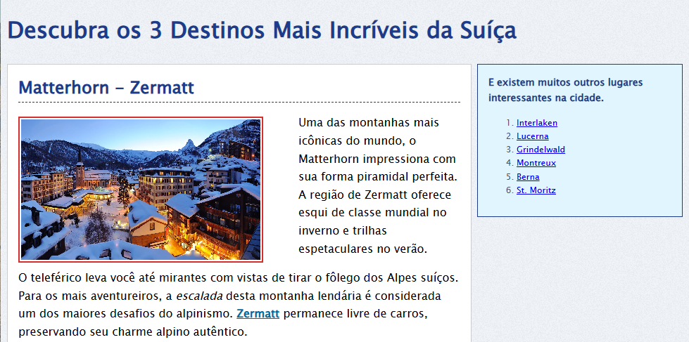

# 🌄 Suíça: 3 Destinos Imperdíveis

Este projeto foi criado por iniciativa pessoal, como parte dos estudos em desenvolvimento web. Surgiu como uma forma prática de aplicar os conhecimentos adquiridos durante a leitura do livro **"HTML5 e CSS3: Domine a web do futuro"**.
<p align="center">
  
</p>


## Objetivo

Desenvolver uma página web informativa e visualmente agradável sobre três dos destinos turísticos mais incríveis da Suíça, utilizando HTML e CSS.

## Conteúdo da Página

A página apresenta os seguintes destinos:

1. **Matterhorn - Zermatt**
2. **Jungfraujoch - Topo da Europa**
3. **Lago de Genebra**

Além disso, há uma seção lateral com sugestões de outros lugares incríveis para visitar na Suíça, como Interlaken, Lucerna, Berna e St. Moritz.

## 🛠️ Tecnologias Utilizadas

- **HTML5**: estruturação semântica do conteúdo
- **CSS3**: estilização visual e layout

## Como Visualizar

Clone o repositório e abra o arquivo `index.html` em seu navegador:

```bash
git clone https://github.com/iamandaleao/top3-switzerland.git
cd top3-switzerland
```

Depois, abra o arquivo `index.html` no navegador.

## Estilo Visual

O projeto utiliza uma paleta suave com fundo texturizado, imagens com bordas destacadas e tipografia clara. O layout é dividido entre conteúdo principal e uma barra lateral com sugestões adicionais.

## Referência

Este projeto foi inspirado no livro **"HTML5 e CSS3: Domine a web do futuro"**, utilizado como material de apoio nos estudos.

## 🤝 Contribuições

Sugestões e feedbacks são sempre bem-vindos!

<div align="center">
  Desenvolvido com ❤️ por <a href="https://www.linkedin.com/in/iamandaleao/" target="_blank">Amanda Leão</a>
</div>


